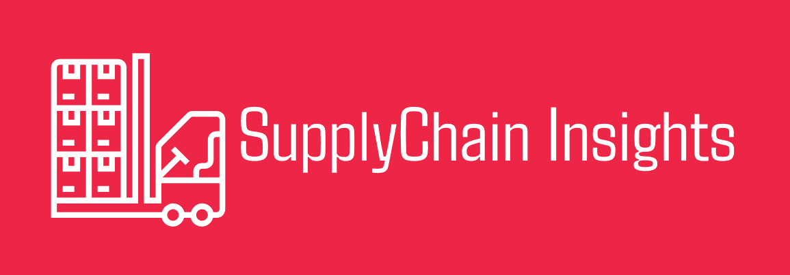
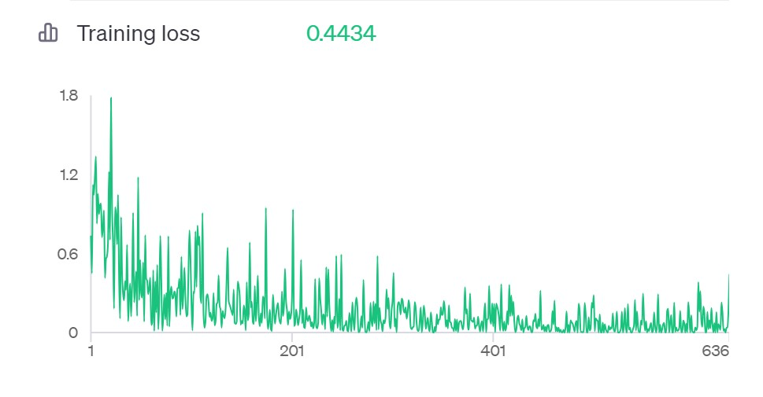
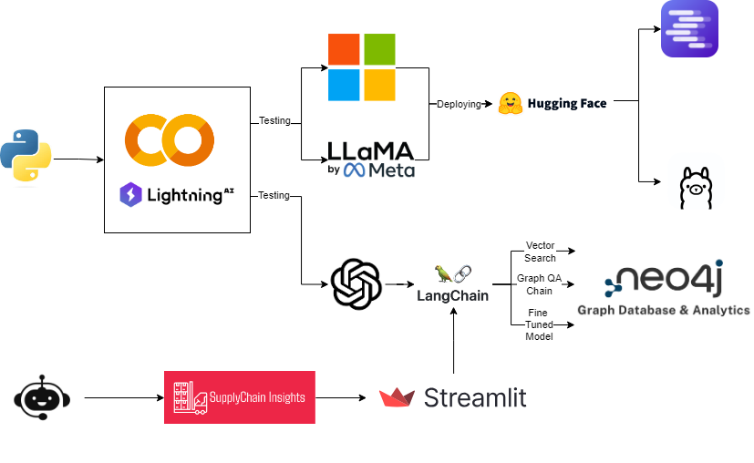

# SupplyChainInsights

**NUID - 002751339**



[Video Demonstration of Application](https://www.youtube.com/watch?v=oAhlNXMpGuo)

[Detailed Report of Application](Files/Final_Project_Report.pdf)

## Table of Contents

- [Overview](#overview)
- [Dataset](#dataset)
- [Key Features](#key-features)
- [About RAG](#about-rag)
- [About Fine Tuning](#about-fine-tuning)
- [About Performance Monitoring](#about-performance-monitoring)
- [Project Architecture](#project-architecture)
- [Setup Instructions](#setup-instructions)
- [Contact](#contact)
- 
## Overview

This repository contains a project focused on analyzing global health commodity supply chains, specifically Antiretroviral (ARV) and HIV lab shipments. The project utilizes neo4j graph databases, advanced graph data science techniques, and retrieval-augmented generation (RAG) for enhanced data exploration and insights. Additionally there is also a Fine tuned model which is produced using Llama3, Unsloth and HuggingFace. Model Fine tuning helps ensure that the data is not compromised by external LLMs and enables to query the data with ease.

It is also important to understand what are [Cypher Queries](https://neo4j.com/docs/cypher-manual/current/introduction/). Think of it like SQL which can be used to query Relational Databases. CQL or Cyper Query Language can help access Neo4j databases which are NoSQL. SupplyChainInsighs leverages CQL to refine the application.

## Dataset

The dataset used in this project provides comprehensive information on supply chain health commodity shipments and pricing. It includes data on ARV and HIV lab shipments to supported countries, along with commodity pricing, supply chain expenses, and volumes delivered by country.

## Key Features

- Neo4j Graph Database: Constructs a graph database to model and analyze supply chain relationships.
- Retrieval-Augmented Generation (RAG): Implements RAG for enhanced data retrieval and user interaction.
- Fine Tuned Model with Cypher QA Chain trained.
- Peformance Monitoring using RAGAS framework 


**All the features are coordinated by Langchains multi agent tool. Depending on whata the users queries are 
the right functionality will be executed. This faciliates problem solving on multiple fronts.**

## About RAG 

- Utilising vector search using OpenAI embeddings - This enables users to directly tap into key aspects of the data.
	
	- Each product has a lot of data points associated with it and users can query products based on granular details

- Enabling Cypher QA Chain - With the help of Langchain we can convert a Natural Language Query to Cypher Query.
	
	- Utilising this aspect to tap into the rich data source using Cypher queries. Each query gets executed and generates 
	the data which gets refined by OpenAI

	- Additionally this can also be used to get the data and plot visuals which is feature of SupplyChainInsights 

## About Fine Tuning 

- Utilising open source LLMs to handle natural language queries. This is a test to see how good they perform with respect to my RAG 
application. Using custom training data, I hve trained the models on a set of questions and responses.

- To facilitate my Fine tuned models I have analysed 4 models which have been used in this analysis (linked to the respective HuggingFace Repo) 

1. [Phi3](https://huggingface.co/abhi7991/promptFineTuning) - SLM from Microsoft 
2. [Llama3 - 8b](https://huggingface.co/abhi7991/promptfinetuning-llama3) - Meta's Open Source Model 
3. [Llama3 - 8b (Developed by Neo4j)](https://huggingface.co/collections/tomasonjo/llama3-text2cypher-demo-6647a9eae51e5310c9cfddcf) -  Meta's Open Source Model fine tuned by Neo4j Developers

	For my [Phi3](https://huggingface.co/abhi7991/promptFineTuning) and [Llama3 - 8b](https://huggingface.co/abhi7991/promptfinetuning-llama3) models I fine tuned them Using Unsloth 

	The models were processed on special platforms like [lightening.ai](lightening.ai) and Google Colab to make use of the GPU


	**Refer to the notebooks below to get a deeper understanding of the entire fine tuning process as well as implementation**

	- [Generating Training Data](fine_tuning/notebook/Generate_Training_Data2.ipynb)

	- [Fine Tuning Phi3](fine_tuning/notebook/FineTuning_Phi3.ipynb)

	- [Fine Tuning Llama3](fine_tuning/notebook/FineTuning_llama3.ipynb)

	- [Comparing models Locally](fine_tuning/notebook/Comparing_FineTunedLLMs-Local.ipynb)

4. [GPT - 3.5](https://platform.openai.com/docs/guides/fine-tuning/analyzing-your-fine-tuned-model)

	After several attempts at fine tuning models using Hyperparamater tuning and training data I used OpenAI's services to finetune my model.
	In this case I used their UI to fine tune my model to see the ease in using GPT. I have highlighted my key takeaways below. 

    - Pros: Faster compute speed, ease in user experience and ease in configuring to applications 
    - Cons: Paid, less refined finetuning, not open source 

    from my training data above I created a [custom script](fine_tuning/notebook/Generate_Training_Data3_GPT.py) to change my training data to a jsonl which can be ingested by GPT. My model trained on over 200 questions and responses. The training data is shown below visually. 


    

    I have integrated this into my application to show how quickly fine tuned GPT models can be intergated into applications. This faciliates the application to generate cypher queries on the fly allowing users to understand and tap into a rich data source

## About Performance Monitoring

[Ragas](https://docs.ragas.io/en/stable/index.html) is a framework that helps you evaluate your Retrieval-Augmented Generation (RAG) pipelines. RAG denotes a class of LLM applications that use external data to augment the LLM’s context. There are existing tools and frameworks that help you build these pipelines, but evaluating and quantifying your pipeline performance can be challenging. This is where Ragas (RAG Assessment) comes in.

Ragas provides a structured approach to evaluating RAG models by offering a variety of metrics that assess different aspects of the model’s performance. By using Ragas, you can gain a detailed understanding of how well your RAG pipeline is performing and identify areas for improvement. The evaluation framework provided here helps in assessing the performance and effectiveness of RAG models in generating accurate and relevant answers by utilizing retrieved contexts.

## Project Architecture 




## Setup Instructions

1) Clone the repo 
2) Create an .env file with the following variables - 

*Ensure the OpenAI API key is the latest*
*Download a desktop version of Neo4j*
```
NEO4J_URI = ''
NEO4J_USER = ''
NEO4J_PASSWORD = ''
OPENAI_API_KEY=''
```
3. Create a new Python environment
4. Install the requirements.txt associated with the repo.
5. Ensure you have the dataset downloaded.
6. run the command  `streamlit run app.py`

## Contact

[Linkedin](https://www.linkedin.com/in/abhishekshankar97/)
[Email](mailto:shankar.abhi@northeastern.edu)
